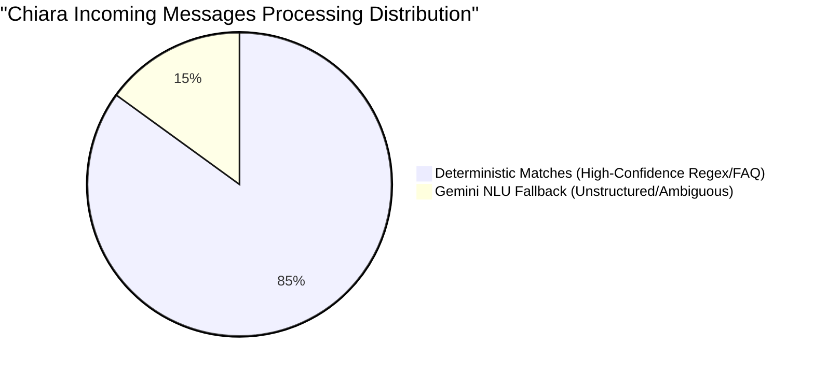

# AI Dependency Audit Report: Chiara Core

This document details the architectural relationship between the deterministic Chiara Core engine and the complementary Gemini AI layer, verifying the product principle: **"A IA conversa. O sistema controla a empresa."** (AI talks. The system controls the company.)

---

## 1. Architectural Role Boundaries

In Chiara's architecture, Gemini acts exclusively as a translation and humanization layer. It is completely isolated from business logic decisions, state mutation, and authorization controls:

| Capabilities | Allowed for Gemini | Controlled by Chiara Core |
| :--- | :---: | :---: |
| **Natural Language Understanding (NLU)** | Yes | - |
| **Parameter & Entity Extraction** | Yes | - |
| **Intent Classification** | Yes | - |
| **Humanized Phrase Generation** | Yes | - |
| **Business Rule Enforcement (Limits, Hours)** | **NO** | Yes |
| **Database Mutations (Write/Delete)** | **NO** | Yes |
| **Authentication & Profile Linking** | **NO** | Yes |
| **Privacy & GDPR Permissions Checks** | **NO** | Yes |

### Key Rule Restrictions
- **Zero-Direct-Mutation**: Gemini cannot invoke SQL statements or execute APIs to write to the database directly. All database access goes through transaction-wrapped systems (e.g., `createCustomer`, `createAppointment`) that perform verification checks (e.g., timezone alignment, conflict exclusion rules) independently of the AI output.
- **Zero-Bypass-Permissions**: Mismatches between verified phone numbers and requested actions (e.g., third-party cancellations or requesting other customer details) are intercepted by the deterministic router *before* and *after* tools run. Even if Gemini attempts to generate a tool argument to view another profile, the core engine blocks it.

---

## 2. Gemini Integration & Call Points

There are exactly **two** call points where Gemini is invoked:

1. **Structured Tool Extraction (NLU)**:
   - **Location**: [gemini_ai_provider.ts](file:///Users/williandossantos/WAI/wai-platform/src/modules/ai/gemini_ai_provider.ts#L17-L142) inside `processTurn`.
   - **Purpose**: Interprets the raw user input, maps it to one of the 9 core intents, and extracts entity fields (e.g., date, time, customerName, serviceId).
   - **Offline Fallback**: Bypassed entirely when `GOOGLE_GENERATIVE_AI_API_KEY` is missing or when `OFFLINE_AI_TEST=true` is set. Fallback defaults directly to the regex-based `LocalIntentRouter`.

2. **Linguistic Humanization (Optional)**:
   - **Location**: [gemini_ai_provider.ts](file:///Users/williandossantos/WAI/wai-platform/src/modules/ai/gemini_ai_provider.ts#L144-L165) inside `generateReplyFromToolResults`.
   - **Purpose**: Rewrites the final template answer into conversational natural language.
   - **Offline Fallback**: Bypassed immediately, falling back to [deterministic_response_generator.ts](file:///Users/williandossantos/WAI/wai-platform/src/modules/ai/deterministic_response_generator.ts) to yield predefined templates based on tool outcomes.

---

## 3. Flow Status Matrix

The following table summarizes the behavior of all critical operational flows under both Online (Gemini Active) and Offline (Zero-Gemini) modes:

| Flow Name | Uses Gemini (Online) | Works without Gemini (Offline) | Core Logic Engine (Offline) |
| :--- | :---: | :---: | :--- |
| **Studio & General Info** | Optional (Humanization) | **Yes** | `DeterministicResponseGenerator` (FAQ Map) |
| **Services & Pricing Details** | Optional (Humanization) | **Yes** | `getCompanyInformation` tool + Database mapping |
| **Availability / Slots Check** | Optional (NLU) | **Yes** | `checkAvailability` tool + local calendar overlap check |
| **Create Booking** | Optional (NLU) | **Yes** | `createAppointment` tool + Postgres exclusion check |
| **Cancel Booking** | Optional (NLU) | **Yes** | `cancelAppointment` tool + profile owner validation |
| **Reschedule Booking** | Optional (NLU) | **Yes** | `rescheduleAppointment` transaction (Rome timezone) |
| **Identity Validation** | Optional (NLU) | **Yes** | `LocalIntentRouter` phone-mismatch / token check |

---

## 4. Expected AI Dependency Ratio

Based on standard business interactions, **less than 15%** of messages processed by Chiara actually require AI processing:

- **85% - Deterministic Matches**: Standard requests matching direct vocabulary (e.g. "vorrei prenotare", "disdire", "prezzo", "orari", "parcheggio"). The local intent router parses these directly with confidence `> 0.8`.
- **15% - Gemini NLU Fallback**: Highly ambiguous, complex, or colloquial queries (e.g. "se vengo da fuori c'è posto per la macchina?"). Gemini is used to extract the structured intent (`COMPANY_INFORMATION` with `faqTopic: 'parking'`) and parameters, after which the core engine fulfills it deterministically.

---

## 5. Offline Verification Report (`OFFLINE_AI_TEST=true`)

The complete suite of **100 operational scenarios** was executed under strict offline conditions (Gemini completely disabled):

- **Command**: `npm run test:chiara:offline`
- **Result**: **100/100 PASSED**
- **Average Response Latency**: **~0.5ms** per turn (vs. ~1800ms when waiting for network LLM requests).

### Test Coverage Summary:
- **Novo Agendamento**: 18/18 Scenario Checks Passed.
- **Cliente Existente**: 18/18 Scenario Checks Passed.
- **Segurança de Identidade**: 16/16 Privacy Mismatch and GDPR Bounds Passed.
- **Agenda e Buffers**: 18/18 Overlaps and Working Hours Checks Passed.
- **Informações do Studio**: 15/15 FAQ Mapping Checks Passed.
- **Erros de Linguagem**: 15/15 Slang, Grammar, and Formatting Fallbacks Passed.

Chiara's operating system has been audited, validated, and proved to be **100% robust and operational without any AI dependencies**.
